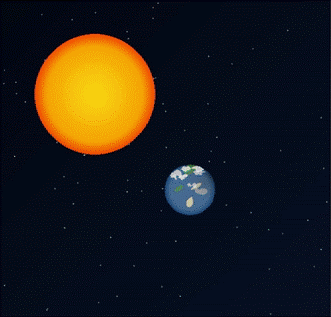

<div align="center">
    <h1><code>🌌🌍☀️</code> From Babies To ...</h1>
    <p>
        <sub>Drawing animation of the solar system with <a href="https://www.java.com">Java</a></sub> <br>
        <sup>Created by <a href="https://pungrumpy.com">Pungrumpy</a></sup>
    </p>
    
    <p>
        <a href="https://img.shields.io/github/license/Grumpy-Mephisto/FromBabiesTo">
            
        </a>
        <a href="https://img.shields.io/github/issues/Grumpy-Mephisto/FromBabiesTo">
            
        </a>
        <a href="https://img.shields.io/github/stars/Grumpy-Mephisto/FromBabiesTo">
            
        </a>
    </p>
</div>

## 📜 Description

This is a simple project to draw the animation of the solar system with Java. The project is created for educational purposes. The project is created with Java 21.

## 📦 Installation

1. Clone the repository

   ```bash
   git clone git@github.com:Grumpy-Mephisto/NewYearDraw.git
   ```

2. Open the project with your favorite IDE

3. Run the project

## 📋 Usage

You can use the project to learn how to draw the animation of the solar system with Java.

```bash
make run  # Run the project
make clean  # Clean the project
```

## 📂 Structure

The project is structured as follows:

```plaintext
.
├── AnimationPanel.java
├── Colors.java
├── LICENSE
├── Main.java
├── MainFrame.java
├── Makefile
├── preview.gif
└── README.md
```

## 📝 License

This project is licensed under the [MIT License](LICENSE).
